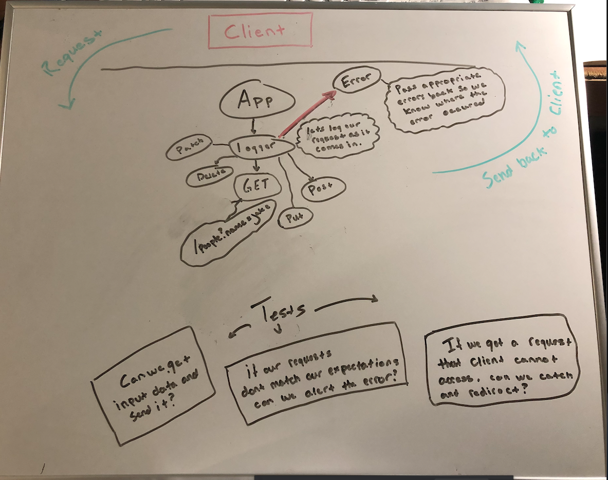

# basic-express-server

This is a server template. The idea of this excercise is to have a fully functioning server that we can reference to get a server up and spinning quick and easily over the course of 401.

Express Server
Created by Jacob Gregor

Installation

npm install { jest, express, dotenv, supertest}

Summary of Problem Domain

Review server setup and instalation. What is the appropriate file-tree setup and how to we test server calls to make sure our server is deployed and communicating with requests.

Links to application deployment

GET: https://basic-express-server-jake.herokuapp.com/person?name=jake

Heroku: https://basic-express-server-jake.herokuapp.com  
GitHub: https://github.com/Code-Fellows-401/server-deployment-practice

Embedded UML

WhiteBaord for Lab-02:
\
\
WhiteBoard for Lab-03:\
\

Talk about your routes

Path: /person?name=
responds with an { Object } with a key: value pair as follows -> {name: 'Name Here'}.
HTTP GET
